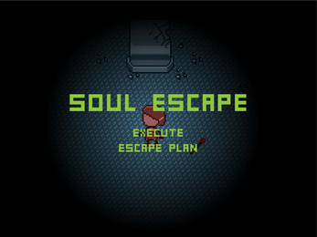
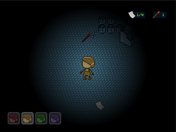
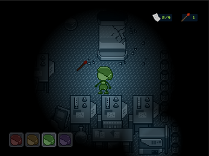
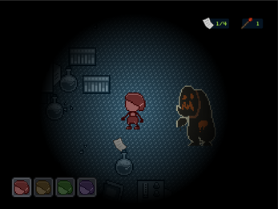
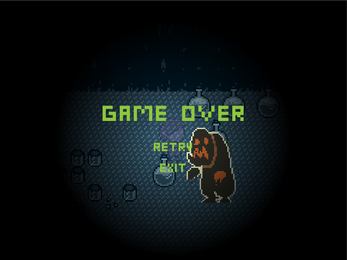

# Soul Escape

2D horror escape game
published at: https://nicholaspixel.itch.io/soulescape

You are playing as a soul who can freely teleport between puppets.

Your objective is to find magic-infused paper and feed them to the generator to escape the room. The room has a mutated monster that can seal puppets, so watch out. You can collect 'flares' and put them on the floor to distract the monster. Once all 4 puppets have been sealed, then you lose.

WASD - move character

E - unseal puppet

F - put flare

G - interact with generator

1234 - change puppets

## Showcase

